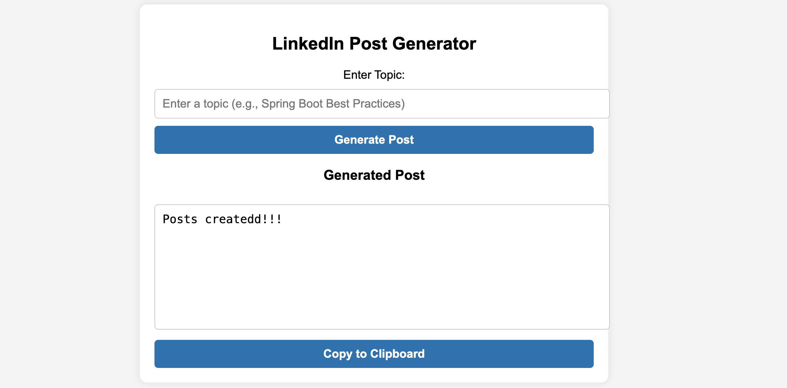

# 🌟 LinkedIn Post Generator

## 📌 About This Project
Ever struggled with crafting the perfect LinkedIn post? The **LinkedIn Post Generator** is here to help! This simple yet powerful Spring Boot application uses **OpenAI** to generate engaging LinkedIn posts based on topics you provide. The UI, built with **Thymeleaf**, makes it easy to enter a topic, generate a post, edit it, and copy it with a single click.

## 🚀 Why You'll Love It
- ✨ **Easy-to-use UI** – Just enter a topic and get an AI-generated post.
- 🤖 **Smart AI-powered content** – Uses OpenAI to generate professional LinkedIn posts.
- 📝 **Fully editable text box** – Customize your post before publishing.
- 📋 **One-click copy feature** – Quickly copy your post to LinkedIn.
- 💾 **Saves posts in MySQL** – Keep track of your generated posts.

## 🛠️ Tech Stack
- **Backend:** Spring Boot, Java, OpenAI API
- **Frontend:** Thymeleaf, HTML, CSS, JavaScript
- **Database:** MySQL
- **Build Tool:** Maven

## 📂 Project Structure
```
📦 linkedin-post-generator
├── 📂 src/main/java/com/linkpost/generator
│   ├── 📂 controller  # Handles UI requests
│   ├── 📂 service     # OpenAI API integration
│   ├── 📂 entities       # LinkedInPost entities
│   ├── 📂 repositories  # JPA Repository for MySQL
│   ├── 📂 config      # Application configurations
├── 📂 src/main/resources/templates  # Thymeleaf UI files
├── 📂 src/main/resources/static      # CSS, JS , image files
├── 📜 application.properties         # Database & API configurations
├── 📜 pom.xml                        # Dependencies
```

## 🔧 How to Set Up & Run
### 1️⃣ Clone the Repository
```sh
git clone https://github.com/your-repo/linkedin-post-generator.git
cd linkedin-post-generator
```

### 2️⃣ Configure Your Database
Create a MySQL database named `linkedin_posts` and update your `application.properties` file:
```properties
spring.datasource.url=jdbc:mysql://localhost:3306/linkedin_posts?useSSL=false&serverTimezone=UTC
spring.datasource.username=root
spring.datasource.password=yourpassword
spring.datasource.driver-class-name=com.mysql.cj.jdbc.Driver
spring.jpa.hibernate.ddl-auto=update
spring.jpa.database-platform=org.hibernate.dialect.MySQL8Dialect
```
> 🔹 Replace `yourpassword` with your actual MySQL password.

### 3️⃣ Add Your OpenAI API Key
Insert this into `application.properties`:
```properties
openai.api.key=YOUR_OPENAI_API_KEY
```

### 4️⃣ Build and Run the Project
```sh
mvn clean install
mvn spring-boot:run
```

### 5️⃣ Open the Application
Visit **[http://localhost:8080/posts](http://localhost:8080/posts)** in your browser.

## 📸 Screenshots
### 🏠 Home Page



## 🤝 Want to Contribute?
We'd love your help! Follow these simple steps:
1. **Fork the repository** to your GitHub.
2. **Create a new branch** (`feature/new-feature`).
3. **Commit and push** your changes.
4. **Submit a pull request** – and we’ll review it!

## 📜 License
This project is open-source under the **MIT License**.

---
💡 **Built with ❤️ by Muskan** | 🚀 Happy Coding & LinkedIn Posting!

